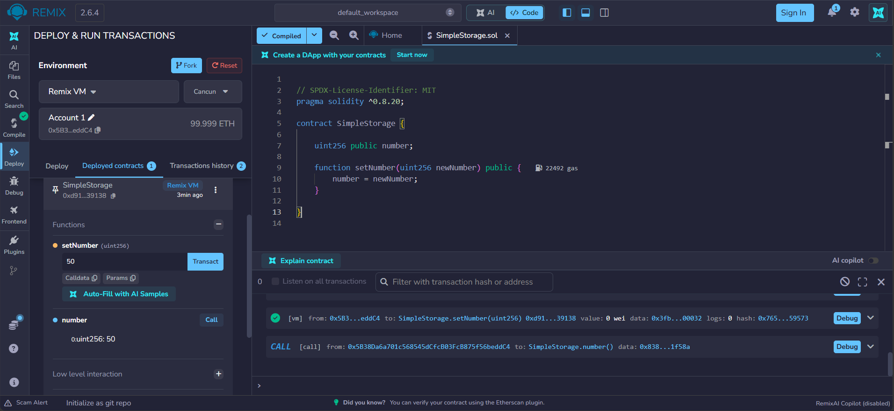

[README.md](https://github.com/user-attachments/files/32781704/README.md)
# Solidity Learning Journey

I'm learning how Ethereum smart contracts work by building small exercises in Remix IDE.

## SimpleStorage

My first exercise is a Solidity contract that stores a whole number. `setNumber()` changes the stored value and the automatically generated `number()` getter reads it.

I compiled the contract and deployed it locally using Remix VM (Cancun). I then called `setNumber(50)` and verified that `number()` returned `50`.

### Try it

1. Open [Remix IDE](https://app.remix.live/).
2. Open `contracts/SimpleStorage.sol` in the editor.
3. Compile using a Solidity 0.8.20-compatible compiler.
4. In Deploy & Run Transactions, select Remix VM and deploy `SimpleStorage`.
5. Call `number()` to read the initial value, `0`.
6. Enter `50` in `setNumber` and submit the simulated transaction.
7. Call `number()` again to confirm the stored value changed to `50`.

This is a beginner learning exercise deployed to Remix's simulated blockchain, not a public Ethereum network or a production application.
